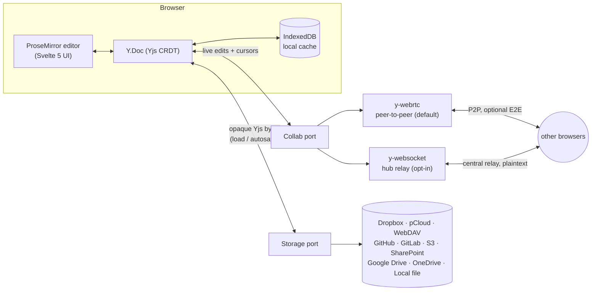

# Copad

[](https://github.com/adriendellagaspera/copad/actions/workflows/ci.yml)
[](https://github.com/adriendellagaspera/copad/actions/workflows/deploy.yml)

I wanted to collaborate on a file in my pCloud. I found nothing off the shelf, so I built this.

## The contract

**Copad only writes where your writing goes** — to a peer receiving it, or to a backend durably keeping it.
Never silently to neither: the editor is read-only while alone, in a peer-to-peer room with nothing durable
behind it. That's deliberately overridable — an explicit `Write alone anyway` button says exactly what it costs
(_nothing you write leaves this device until someone joins_) rather than silently letting you write into the
void. That promise, and what it costs, is written out in full in [`docs/contract.md`](docs/contract.md) — read
it before relying on this app with anything you'd mind losing.

Ownership is the companion clause, not the headline: the document is a real file, in a folder you already pay
for, on a service you already chose. No new subscription, no proprietary format, no vault.

## How it works



Two ports, each with swappable adapters — see [`docs/architecture.md`](docs/architecture.md) for the full
port/adapter table and the type system that keeps them honest:

- **`Collab`** — [Yjs](https://github.com/yjs/yjs) CRDT state over [y-webrtc](https://github.com/yjs/y-webrtc)
  (P2P, default, optionally end-to-end encrypted) or [y-websocket](https://github.com/yjs/y-websocket) (central
  hub, no NAT traversal needed, no E2E). `VITE_COLLAB_TRANSPORT` picks one.
- **`Storage`** — a bytes-only `load`/`save` over the user's own cloud folder. The editor is
  [ProseMirror](https://prosemirror.net); persisted bytes are the Yjs snapshot, converted to/from a target file
  format by a `Codec` (`.yjs`/`.md`/`.txt`/`.html`/`.json`) picked from the filename.

## Storage backends

| Backend                                                                                                               | Auth                                                                                                                  | CORS                    |
| --------------------------------------------------------------------------------------------------------------------- | --------------------------------------------------------------------------------------------------------------------- | ----------------------- |
| [Dropbox](https://www.dropbox.com/developers/apps)                                                                    | OAuth2 PKCE                                                                                                           | native                  |
| [pCloud](https://docs.pcloud.com)                                                                                     | OAuth popup                                                                                                           | reads need the proxy    |
| WebDAV / [Nextcloud](https://docs.nextcloud.com/server/latest/user_manual/en/files/access_webdav.html)                | app password                                                                                                          | usually needs the proxy |
| [GitHub](https://docs.github.com/en/rest)                                                                             | PAT                                                                                                                   | native                  |
| [GitLab](https://docs.gitlab.com/ee/api/rest/)                                                                        | PAT                                                                                                                   | native                  |
| S3-compatible (AWS/R2/MinIO/B2/…)                                                                                     | access keys, [SigV4](https://docs.aws.amazon.com/IAM/latest/UserGuide/create-signed-request.html) via `crypto.subtle` | bucket must allow it    |
| [SharePoint / OneDrive for Business](https://learn.microsoft.com/en-us/graph/api/resources/onedrive)                  | Graph token                                                                                                           | native                  |
| [Google Drive](https://developers.google.com/drive/api/guides/api-specific-auth)                                      | OAuth2 PKCE, `drive.file` scope                                                                                       | native                  |
| [OneDrive (personal)](https://learn.microsoft.com/en-us/onedrive/developer/rest-api/getting-started/app-registration) | OAuth2 PKCE, `Files.ReadWrite.AppFolder`                                                                              | native                  |
| Local file                                                                                                            | [File System Access API](https://developer.mozilla.org/en-US/docs/Web/API/File_System_API)                            | Chrome/Edge only        |

Each adapter implements `Storage` (`src/storage/types.ts`); auth is a separate `StorageAuth` port so
`Editor.svelte` never sees credentials. Config fields (app keys) live in Settings ⚙ or a `VITE_*` env override —
see the table in [`docs/architecture.md`](docs/architecture.md#environment-variables). Adding a backend means
writing one adapter and registering it in `src/storage/index.ts`; nothing else changes.

Backends without native CORS go through [`deploy/proxy-worker/`](deploy/proxy-worker/), a generic forward proxy
(set `VITE_PROXY_URL`, restrict `ALLOWED_HOSTS`). Runs free on Cloudflare Workers.

## Quick start

```bash
npm install
cp .env.example .env        # configure at least one backend — Dropbox is the easiest
npm run signaling            # terminal 1 — WebRTC signaling, ws://localhost:4444
npm run dev                  # terminal 2 — the app, http://localhost:5173
```

Open two tabs, type in one. Pick a storage backend from the pills under the header and connect it to enable
save/restore.

Local dev OAuth redirect: `http://localhost:5173/redirect.html` (register it in each provider's developer
console alongside your production URL).

### Git hooks

[`./pre-commit`](./pre-commit) and [`./pre-push`](./pre-push) run a subset of `npm run lint`/`check`/`test`
locally, so the common regression is cheap to find before a CI round trip. Link them once:

```bash
ln -sf ../../pre-commit .git/hooks/pre-commit
ln -sf ../../pre-push .git/hooks/pre-push
```

Claude Code web sessions link both automatically at session start (`.claude/hooks/session-start.sh`). Skip
either check with `git commit`/`push --no-verify` — CI is not skippable that way and remains the authority.

## Deployment

1. **Frontend** — `npm run build` → deploy `dist/` anywhere static (Cloudflare Pages, Netlify, GitHub Pages —
   see [`.github/workflows/deploy.yml`](.github/workflows/deploy.yml)).
2. **A collaboration server** — required, and not vendored here: both transports run an **upstream package's
   bundled bin** on any Node host.

   | Transport          | Package                                                            | Bin                  |
   | ------------------ | ------------------------------------------------------------------ | -------------------- |
   | `webrtc` (default) | [`y-webrtc`](https://github.com/yjs/y-webrtc)                      | `y-webrtc-signaling` |
   | `websocket`        | [`@y/websocket-server`](https://github.com/yjs/y-websocket-server) | `y-websocket-server` |

   Point a host at a 3-line `package.json` depending on the package, `npm start` running its bin, `HOST=0.0.0.0`
   if the platform needs it. Set `VITE_SIGNALING_URL` / `VITE_WEBSOCKET_URL` to the resulting `wss://` URL (must
   be `wss://` — mixed content blocks plain `ws://` from an `https://` page).

3. **TURN**, for WebRTC on mobile/CGNAT/symmetric NAT — a free public relay is the default; bring your own via
   `VITE_TURN_URL` or self-host [coturn](https://github.com/coturn/coturn) ([`deploy/turn/`](deploy/turn/)).
   Sidestep it entirely with the WebSocket transport.
4. **(Optional) proxy** — `cd deploy/proxy-worker && npx wrangler deploy`.

Full env var reference: [`docs/architecture.md`](docs/architecture.md#environment-variables).

## Known limitations

- **OAuth tokens live in the browser.** Acceptable for a small app; route through the proxy to keep secrets
  server-side for a harder posture.
- **No single authority.** For a stronger consistency story than P2P leader election, swap `Collab` for a small
  Yjs server ([Hocuspocus](https://tiptap.dev/docs/hocuspocus/introduction) or a Durable Object) persisting
  through the same `Storage` port.
- **Cross-machine file collisions aren't detectable.** Two rooms on one backend pointed at the same file are
  caught only within one browser (`firstFileCollision()` in `src/storage/filename.ts`) — there's no server to
  coordinate room→file ownership across machines, by design. Give each room a distinct filename.

## Project layout

Architecture, ports/adapters, and the type system are documented in
[`docs/architecture.md`](docs/architecture.md) — that file, not this one, is the source of truth for how the
codebase fits together.

```
src/
  storage/         Storage + StorageAuth ports, one adapter per backend
  collaboration/    Collab port, webrtc/websocket adapters, room access/cipher, presence
  format/          Codec port — bytes ⟷ Y.Doc per file extension
  editor/          ProseMirror schema, plugins, commands
  persistence/     localStorage primitive (the only module touching it)
  ui/              Svelte components
  App.svelte       room management, wiring, top-level state
  Editor.svelte    ProseMirror + Yjs binding, autosave, leader election
```

## License

MIT
