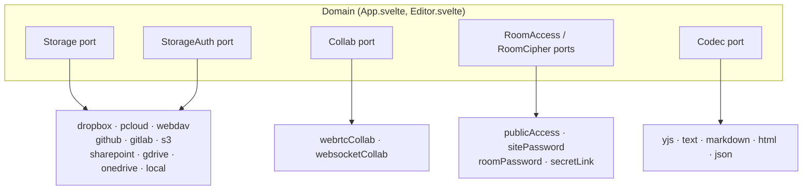

# Copad architecture reference

Deep reference for how the codebase is structured: ports/adapters, wiring, file
formats, config, deployment. Contribution **rules** live in
[`AGENTS.md`](../AGENTS.md): this file is descriptive, not normative, and
nothing here needs to be read before writing code; look things up as they
become relevant. For the product-facing overview (quick start, deployment
steps, known limitations) see [`README.md`](../README.md).

## Architecture

Copad follows **hexagonal architecture** (ports & adapters, see
[Alistair Cockburn's original writeup](https://alistair.cockburn.us/hexagonal-architecture/))
with a **functional style**: factory functions returning plain objects, never classes.
See [`README.md`](../README.md#how-it-works) for the runtime data-flow diagram; this section
is the reference for what implements what.

### Ports (interfaces)

| Port | File | Description |
|------|------|-------------|
| `Storage` | `src/storage/types.ts` | Persist and restore document bytes for a backend's target file (bytes-only, no auth). Optional `list()`/`loadFrom()` let a backend also browse and read an arbitrary *other* file within its already-connected scope (e.g. another file in the same GitHub repo or OneDrive AppFolder), implemented only where listing needs no new API surface or broader auth scope (GitHub, OneDrive personal); a backend without them simply has no "Browse…" entry. |
| `StorageAuth` | `src/storage/auth.ts` | Authenticate to a cloud storage backend; owns login/logout/config |
| `Collab` | `src/collaboration/types.ts` | Provide a shared Y.Doc and awareness channel |
| `CollabConnect` | `src/collaboration/types.ts` | Factory type: `(room: string) => Collab` |
| `RoomAccess` | `src/collaboration/roomAccess.ts` | Who may join a room (`mode` + `credential(room)`) |
| `RoomCipher` | `src/collaboration/roomCipher.ts` | How a room is encrypted (`password(room): string \| null`) |
| `Codec` | `src/format/types.ts` | Convert file bytes ⟷ the shared Y.Doc, selected by filename extension |

### Adapters (implementations)

Storage adapters return `{ auth: StorageAuth; storage: Storage }`: auth and bytes live in a shared closure but are exposed through separate ports. The `StorageBackend` type alias (in `src/storage/index.ts`) names the pair.

| Adapter | File | Notes |
|---------|------|-------|
| `dropboxStorage()` | `src/storage/dropbox.ts` | OAuth2 PKCE, no proxy needed |
| `pcloudStorage()` | `src/storage/pcloud.ts` | OAuth popup |
| `webdavStorage()` | `src/storage/webdav.ts` | Requires `VITE_PROXY_URL` (CORS) |
| `githubStorage()` | `src/storage/github.ts` | Commits to a GitHub repo via PAT; `contentFormat` is `'text'` for human-readable files, `'binary'` for `.yjs`. |
| `gitlabStorage()` | `src/storage/gitlab.ts` | Commits to a GitLab project (gitlab.com or self-hosted) via PAT; mirrors `githubStorage()` (configFields + validated flag + POST/PUT create-or-update). |
| `s3Storage()` | `src/storage/s3.ts` | Any S3-compatible bucket (AWS, R2, MinIO, B2, GCS…). AWS SigV4 signed with `crypto.subtle` (no SDK); binary `.yjs`; bucket must allow CORS. |
| `sharepointStorage()` | `src/storage/sharepoint.ts` | SharePoint or a *work/school* account's OneDrive **for Business** via Microsoft Graph, delegated bearer token (credentialFields, like WebDAV); Graph has native CORS (no proxy). |
| `gdriveStorage()` | `src/storage/gdrive.ts` | OAuth2 PKCE (like Dropbox); `drive.file` scope, file resolved by per-room filename; extension-driven `contentFormat`. |
| `onedriveStorage()` | `src/storage/onedrive.ts` | *Personal* Microsoft account OneDrive via Microsoft Graph, OAuth2 PKCE against the `consumers` tenant (rejects work/school accounts, no overlap with `sharepointStorage()`); `Files.ReadWrite.AppFolder` scope confines access to a dedicated `Apps/<AppName>` special folder, mirroring `drive.file`'s least-privilege shape. |
| `localFsStorage()` | `src/storage/local.ts` | File System Access API, Chrome/Edge only |
| `webrtcCollab()` | `src/collaboration/webrtc.ts` | y-webrtc peer-to-peer transport (**default**). Needs STUN, plus TURN on mobile/symmetric NAT. |
| `websocketCollab()` | `src/collaboration/websocket.ts` | y-websocket hub transport (opt-in via `VITE_COLLAB_TRANSPORT=websocket`). Central relay, **no WebRTC → no STUN/TURN**; server is in the data path (no E2E). |

Both collab adapters are `CollabConnect` factories behind the same `Collab` port, so they're interchangeable. `planCollab()` in `App.svelte` picks one via `resolveTransport(VITE_COLLAB_TRANSPORT)`: WebRTC by default, WebSocket only when explicitly set to `websocket`.

Room access adapters (all in `src/collaboration/roomAccess.ts` / `roomCipher.ts` / `secretLink.ts`):

| Adapter | Port(s) | Notes |
|---------|---------|-------|
| `publicAccess()` | `RoomAccess` | No credential; anyone may join (default) |
| `sitePassword(pw)` | `RoomAccess` | Single shared password from env (`VITE_ROOM_PASSWORD`) |
| `roomPassword()` | `RoomAccess` | Per-room password stored in `localStorage` |
| `secretLink()` | `RoomAccess` + `RoomCipher` | URL-fragment key (`#k=…`); dual-port: the key is simultaneously the access gate and the AES encryption key |
| `plaintext()` | `RoomCipher` | No encryption (`password()` returns `null`) |

`resolveRoomStrategy(VITE_ROOM_AUTH)` parses the env var once and returns a `RoomStrategy`: the `{ access, cipher }` pair built **together** so each strategy keeps its concrete type end-to-end. In particular the `secret-link` dual-port object is assigned directly to both fields (no widen-to-`RoomAccess`-then-cast-back-to-`RoomCipher`). Lives in `src/collaboration/config.ts`.

Both adapters share `createCollabCore()` (`src/collaboration/core.ts`, the transport-agnostic half of a `Collab`): status/synced subscriber fan-out, the `connecting → waiting → connected` machine (falling to `unreachable` if not attached after `CONNECT_TIMEOUT_MS`, so the UI stops spinning on a dead/misconfigured server; cleared by a successful attach or a manual `reconnect()`), online/offline reactivity, the local-cache lifecycle, and teardown. Each adapter supplies only provider wiring + two hooks (`isAttached()`, `peerCount()`); the duplicated boilerplate lives in one place.

### Wiring

`App.svelte` owns all construction and configuration:
- calls `backends()` to get the available `StorageBackend` pairs (`{ auth, storage }`)
- resolves `{ access: roomAccess, cipher: roomCipher } = resolveRoomStrategy(VITE_ROOM_AUTH)` at startup
- calls `planCollab()`, which returns a `build(cache)` that produces `webrtcCollab({ signaling, cipher, iceServers, cache })` by default, or `websocketCollab({ url, cache })` when `VITE_COLLAB_TRANSPORT=websocket`, plus any config warning to surface
- passes both down to `Editor.svelte` as props; Editor receives only the bytes-only `Storage` half (never `StorageAuth`)
- renders the storage **pills** + connect *action zone*, and the `Settings.svelte` drawer

`Editor.svelte` knows only the ports: it never imports y-webrtc, y-websocket, or any storage backend directly. `Settings.svelte` receives `StorageBackend[]` and accesses auth via `b.auth.*`, metadata via `b.storage.*`.

### File formats (the `Codec` port)

A backend moves *bytes*; a **codec** (`src/format/`) turns those bytes into the shared `Y.Doc` and back. The codec is chosen from the target **filename's extension** (`codecForFilename()`), so format support is entirely backend-agnostic.

| Codec | Extensions | Notes |
|-------|-----------|-------|
| `yjsCodec` | `.yjs` | **Native default.** Full CRDT state (history + content): the only format that round-trips collaborative merge. Fallback for unknown extensions. |
| `textCodec` | `.txt`, `.log`, `.csv` and ~90 source-code extensions (the list lives in `src/format/text.ts`) | Plain text and source files; one paragraph per line. Formatting flattened. |
| `markdownCodec` | `.md`, `.markdown` | CommonMark + GFM strikethrough (`~~`), checklists (`- [ ]`/`- [x]`), and tables. No native underline syntax: that mark is flattened to plain text on export. Table cells hold real block content (paragraphs, lists, headings, quotes, code blocks; see `schema.ts`'s `cellContent`), which GFM's pipe-table syntax can't express; such a table round-trips as an embedded raw HTML block (`format/tableMarkdown.ts`) instead, with a plain-text degrade when no DOM is available to build it. A table with only single-paragraph cells still stays plain GFM pipe syntax. |
| `htmlCodec` | `.html`, `.htm` | ProseMirror DOM parser/serializer; **needs a DOM** (browser only). |
| `jsonCodec` | `.json` | ProseMirror document JSON; lossless for our schema. |

- Content codecs reconcile into the shared doc via y-prosemirror's `prosemirrorToYXmlFragment` (the same diff reconciler as `ySyncPlugin`), so importing replaces content cleanly: no duplicated leading paragraph. Shared PM↔Y helpers live in `src/format/pm.ts`.
- Each backend reports its target filename via `Storage.filename()`. **Local** takes it from the picked file; **cloud** backends expose `setFilename()` (a "File name" input in Settings, persisted by `filenameStore()` in `src/storage/filename.ts`). The extension picks the format; it takes effect on connect.
- **The target file is scoped per room.** `filenameStore()` reads an app-global *active room* (set by `App.svelte` via `setActiveRoom()` on startup and every room switch, before the Editor remounts) and persists the name per backend *and room* under `storage.<id>.filename.<room>`. **Every room** a backend saves derives its own file from the room id, keeping the backend default's extension (so `copad-demo` → `copad-demo.yjs`, and no two rooms on one backend collide on one path). This, together with saved rooms above, is what gives each room its own document. (**Local** is the exception: it holds a single picked file in module state and has no `setFilename`, so it effectively serves one room's document at a time; switching rooms no longer carries content, but re-importing in another room repoints its one file.)
- Adding a format = add one codec file + register it in `src/format/index.ts`. The Local file picker (`knownExtensions()`) and Settings copy update automatically.
- **`Export a copy`** (contract §4.3): a one-off download of the current document, independent of any connected storage backend and working while the write-gate holds the editor read-only. `exportCodecs` (`src/format/index.ts`) offers the four portable `Codec` formats (text/markdown/html/json) plus one-way `ExportCodec` formats (below), excluding the native `.yjs` snapshot. `src/editor/exportBridge.svelte.ts` mirrors the `roomName` bridge's shape: a module-level holder the Editor binds on mount (unconditionally, since export is a read) so UI outside the Editor subtree can encode the shared `Y.Doc` without it being threaded through as a prop. `src/ui/ExportFormats.svelte` is the shared format-picker list; `src/ui/ExportDialog.svelte` wraps it in the standard `Dialog.svelte` shell for two of its three triggers: the read-only band (`SyncBanner`'s waiting tier, next to Copy invite link / Connect storage) and an Export button in `App.svelte`'s own header capsule / mobile nav dock, right beside Share and Settings (`App.svelte`'s `exportOpen` state, no prop threading through Editor at all, since export never touches `collab.doc`), while Settings renders `ExportFormats` inline in its own section instead. Three reachable entry points, one download path (`downloadBytes()` in `src/format/download.ts`, File System Access API save picker with a Blob+anchor fallback).
- **`ExportCodec`** (`src/format/types.ts`) is a one-way sibling of `Codec` (`{ id, label, extensions, encode(doc) }`, no `decode`), for formats that are never a save target. It's never added to `codecs`/`knownExtensions()`: there's nothing to decode if a `.docx` is picked in the Local import flow. Every `Codec` structurally satisfies `ExportCodec` too, so `exportCodecs` combines both kinds in one list.
- **PDF**: no client-side rendering library: `ExportFormats.svelte`'s "PDF (print)" entry calls `window.print()`, and `src/styles/print.css` hides all app chrome under `@media print`, leaving only `.editor > .content` to flow across pages. Real, selectable text at native quality; the trade-off is the extra step of choosing "Save as PDF" in the browser's own print dialog.
- **`docxCodec`** (`src/format/docx.ts`): Word export via the `docx` package. Covers headings, emphasis/strike/underline/code marks, links, nested bullet/ordered/task lists, blockquotes, code blocks, horizontal rules and tables. `docx.ts` itself is a thin descriptor; the actual encoding logic (and the `docx` package, ~100kB gzipped) lives in `src/format/docxEncode.ts`, reached only via a dynamic `import()` inside `encode()`, so that cost lands only on a page that actually triggers a Word export, not on the main bundle for every visitor.
- **`Import…`**: a document-level action, not a formatting command, so its button lives in `App.svelte`'s header capsule / mobile nav dock beside Export, not the formatting toolbar. `App.svelte`'s `importLocalFile()` picks a file (`src/format/filePicker.ts`'s `pickFile()`, shared with `src/storage/local.ts`'s own picker) and hands the bytes down through the same `importRequest`/`onImportHandled` bridge Settings' Browse-a-connected-backend dialog uses. App owns every import entry point, but only `Editor.svelte` holds `collab.doc`, so decoding always happens there. Unlike export, this is a write: `decode()` writes straight into `collab.doc`, bypassing ProseMirror's own `editable` check entirely, so the write-gate is re-derived independently at both ends: `App.svelte`'s header button disables itself (`role === SessionRole.Writer && !writeLocked`), and `Editor.svelte`'s `importRequest` effect re-checks the identical condition before ever calling `decode()`, so the gate holds even if a request arrived some other way. Replacing a non-empty document asks for confirmation first (`window.confirm`), since it overwrites content for every live collaborator.
- **Recent documents**: since `room` is fixed for the tab's lifetime (below), a "recent docs" switcher can't switch in place either; `src/ui/RecentDocs.svelte` opens an entry the same way `newRoom()` does, `window.open(entry.url, '_blank', 'noopener')`, never navigating the current tab. `src/collaboration/recentDocs.ts` persists `{ room, url, lastOpened, title }` entries (capped at 20, evicting the oldest by `lastOpened`) under one `localStorage` key via `localStore()`. `url` is a branded `RoomUrl` (`src/collaboration/types.ts`) holding the room's full navigable URL, including the `#k=` secret-link fragment for encrypted rooms, because that fragment can't be reconstructed from the room id alone later; `Editor.svelte` records it from `location.href` in an `$effect` that also re-fires whenever `roomName.value` changes, keeping `title` (the same collaborative `RoomName` `DocTitle.svelte` shows, falling back to the room id) in step without a second "derive a title" mechanism. A button in the header capsule and the mobile dock opens a `Dialog.svelte` listing entries with a per-row remove (×).

### Config vs. credentials

The `StorageAuth` port separates two concerns:
- **`configFields`**: one-time, app-level setup (OAuth app keys / client ids). Edited in the `Settings.svelte` (⚙) drawer, persisted in `localStorage` via the `configStore()` helper (`src/storage/config.ts`). Resolution per field is env var → saved value; an env var (`VITE_*`) *locks* the field as deployment-managed. `configured()` reports whether a backend has everything it needs to attempt a connect.
- **`credentialFields`**: per-session login collected on the front-page connect form (e.g. WebDAV username/password). Not stored as config.

Backends that need neither (Local) omit both. Each backend's front-page **pill** reflects `statusOf()`: `unavailable` → `setup` (missing config) → `ready` → `connected`.

### Constants & deployment config

No magic literal lives buried in business logic. Deployment-relevant constants (endpoints, defaults, timeouts, folder paths, and the localStorage keys each vertical owns) are centralized in a **config/constants module per vertical**, and read a `VITE_*` env override where deployments legitimately vary:
- `src/config.ts`, app-global: the storage **namespace** (`APP_NAMESPACE` / `nsKey()`, default `copad`). Overridable via `VITE_APP_NAMESPACE` so two deployments on one origin can isolate their `copad:`-namespaced state. The no-flash script in `index.html` can't read env at runtime, so it's kept in sync at *build* time by the `inject-app-namespace` plugin in `vite.config.ts` (same default).
- `src/collaboration/constants.ts`: signaling/STUN/room defaults, the signaling keep-alive interval (`VITE_SIGNALING_KEEPALIVE_MS`), local-dev hostnames, cache DB prefixes (plaintext + `enc:`), room-password + room-encrypted keys.
- `src/storage/constants.ts`: backend endpoint URLs/hosts/paths, the shared cloud folder, GitHub API base, OAuth popup tuning + redirect, base64 chunk size, default filenames, and backend identity. `STORAGE_ID` (built by the `storageIds()` brander) is the single source of truth for backend ids: adapters and keys derive from it, so each `as StorageId` cast lives in exactly one place. Every persisted key is built by `backendKey(id, purpose: KeyPurpose)` as a uniform `storage.<id>.<purpose>`. `KeyPurpose` is a union of the fixed singleton slots (`token`, `session`, `conf`, `validated`, `rooms`, typo-checked at call sites) plus a branded `ConfigFieldName` open arm for adapter-defined config fields, branded once at the configStore boundary. (Per-room filenames use their own `storage.<id>.filename.<room>` key built directly, not a `KeyPurpose`.) Each endpoint/host/path/tunable reads a `VITE_*` override (via the `envStr` / `envInt` helpers) so a deployment can react to a provider rotating a domain or a regional split (pCloud US/EU) without a rebuild. `BACKEND_ENABLED` (via the `envBool` helper) lets each backend be hidden entirely (pill and Settings section both gone) via `VITE_ENABLE_<ID>`; `backends()` in `src/storage/index.ts` filters on it. A newly added backend defaults to disabled until it's been connected to a real account outside production; flipping the default to enabled is its own dedicated PR.

The only constants with **no** env override are the per-backend localStorage **key strings** (`storage.<id>.*`, `collab.room-password.*`, `collab.room-encrypted.*`, `collab.room-open.*`; pure identity, changing them just orphans saved state with no deployment benefit) and the GitHub default branch (already deployment-settable via the `branch` config field's `VITE_GITHUB_BRANCH` lock). Changing `VITE_APP_NAMESPACE` on a *live* deployment likewise orphans `copad:`-namespaced state: it's a set-once-at-deploy knob.

## Finding things

`npm run docs` (TypeDoc, markdown output) generates a browsable API index into
`docs/api/`, git-ignored, regenerate whenever you need it. It covers every
exported type/function/interface with its doc comment and exact source
location, straight from the code, so it can't drift the way this file's old
"where things live" section did. Locate things with it (or plain grep;
`AGENTS.md`'s naming rules keep names grep-unambiguous); it can't answer *why*
something is shaped the way it is: that's what the rest of this file, and
in-code comments (`AGENTS.md`'s Comments rule), are for.

## Implementation notes

- **`room` is fixed for the tab's lifetime; two-phase remount handles reconnects**: `App.svelte` reads `room` once (`roomFromUrl()`); "New document" opens a fresh tab instead of switching rooms in place, so there is no in-app room-change remount to handle. A same-room reconnect (TURN/cache/security change) goes through `rebuildCollab()`, which toggles `editorMounted` off → `await tick()` + a macrotask → on: the old provider must fully deregister its room before the new one mounts, because y-webrtc's `openRoom()` throws "already exists" for the same name and would leave the new provider silently unsubscribed. A direct Svelte `{#key}` swap can't guarantee that ordering, hence the explicit two-phase toggle.
- **Leader election**: `src/collaboration/leader.ts`: the peer that writes to storage is the lowest `clientID` **among peers persisting to the same file** (`isPersistLeader`), preventing concurrent-write races on one file. Election is scoped by a `PersistTarget` (a hash of `(browserId + backend id + filename)` broadcast in awareness, `persistTargetKey`), so two peers writing *distinct* files (different backends, or different accounts of one backend, distinguished by the per-browser `browserId` in `src/collaboration/browserId.ts`) each persist their own copy instead of starving one another, while multiple writers of one shared file (or the same user in two tabs) still elect a single writer. The `PersistTarget` is a hash, so the actual account/path/filename never travels in awareness. `browserId` is deliberately **not** per-room: it identifies the browser, and the room dimension already lives in the target's per-room `filename`.
- **File-collision warning**: because a room's target file is user-settable, two rooms on one backend can be pointed at the *same* file (they'd silently overwrite each other). `firstFileCollision()` (`src/storage/filename.ts`) compares the current room's file against every other room the backend saves (`savedRoomsStore(id).all()` × `filenameForRoom()`, resolved with the backend's `defaultFilename()`); `App.svelte` surfaces any clash as a **Conflict** state on `StatusPill.svelte`'s durability segment (→ click to Settings to rename). This is a **same-browser** check only: a same-account clash from *another machine* can't be detected without a coordination point the serverless model omits (documented in the README).
- **Saved rooms (per-user persistence)**: `src/storage/savedRooms.ts`: `savedRoomsStore(id)` records the **set** of rooms a backend saves for the local user, persisted per backend under `storage.<id>.rooms` (JSON array); its API is deliberately screaming: `saves(room)` / `add(room)` / `remove(room)` / `all()`, no "owner". `afterConnect()` in `App.svelte` **adds** the room you're in; disconnect keeps the set so re-login restores your saved rooms instead of orphaning them. `App.svelte`'s `savedHere` derived (`connected && savedRoomsStore(id).saves(room)`) gates the Editor's `storage` prop: in a room your backend doesn't save, the Editor gets `storage = null`, and that room keeps its own document; it is never loaded from or saved to your backend. This is what stops an imported document from following you across rooms (the App-global `storage` used to re-`load()` its single file into every room's fresh Y.Doc). It's a **per-user persistence fact, not a room-level role**: with per-target autosave (see Leader election), several people can each keep their own saved copy of one room, nobody "owns" it. `StatusPill.svelte`'s durability segment reflects it as **Saved** / **Not saved** (click to open Settings and connect a backend). A one-time returning-user default in `App.svelte` adds the room you *land in* only when there's no `?room=` link (a shared link means you're a visitor), so an already-authed backend keeps saving your home room without ever claiming someone else's. Because the target file is **per room** (see below), one backend can save several rooms, each with its own distinct document.
- **Local cache**: `src/collaboration/cache.ts` owns local caching end to end (prefs + DB naming + clear + `attachLocalCache(room, doc, cred?): LocalCache`). Both adapters call `attachLocalCache` when their `cache` opt is true, passing the room credential as `cred`. **No credential → plaintext** y-indexeddb mirror (DB `copad:<room>`); **credential present → AES-GCM encrypted at rest** (DB `copad:enc:<room>`, key derived from the credential, in `encryptedCache.ts`: the single place importing `y-indexeddb` is still `cache.ts`, but `encryptedCache.ts` owns the encrypted append-log over raw IndexedDB). So a reload survives without a backend, and an encrypted room's cache can't be read back without the key. On by default; the Settings toggle flips a localStorage pref that `App.svelte` reads, rebuilds `connect`, and remounts the Editor via `rebuildCollab()` (the two-phase same-room remount). `clearLocalCache()` deletes both DB variants via a remembered-rooms index (not `indexedDB.databases()`, which Firefox lacks). When a room's key changes (Share dialog), `migrateRoomCache(room, from, to)` re-encrypts the cache under the new key **before** reconnecting, so content survives and no copy is left readable under the old key.
- **Per-room encryption**: `webrtcCollab`'s `cipher` (`RoomCipher`) supplies the y-webrtc AES `password` per room. Effective cipher precedence, resolved fresh per connect in `App.svelte`'s `roomCipher`: URL hash `#k=` (a "secure link"; the hash is never sent to the signaling server) → per-room password remembered in localStorage → the `VITE_ROOM_AUTH` strategy's cipher. The `ShareDialog` sets either mode; changing it bumps `collabEpoch` so the Editor remounts and reconnects with the new key. The same credential also keys the encrypted local cache. WebRTC only; the hub relay sees plaintext.
- **Encrypted-room access gate**: encryption is *cooperative* (a wrong/missing key just fails to sync), so on its own an encrypted room opened without the key was indistinguishable from a public one, and the plaintext cache even showed its content on reload. `src/collaboration/roomLock.ts` closes this: on a successful visit *with* a key, a one-way SHA-256 fingerprint of the key (never the key itself) is remembered per room (`collab.room-encrypted.<room>`, via `roomCrypto.keyFingerprint`). On a later visit `roomLockState(room, cred)` compares the current credential's fingerprint to the stored one to tell **correct key / wrong key / no key** apart. When locked, `App.svelte` renders `ui/RoomLock.svelte` instead of the Editor (so a keyless room never mounts the Editor or writes a plaintext cache); entering the key persists it as the room password and reconnects. WebRTC transport only (encryption is WebRTC-only). All crypto lives in `src/collaboration/roomCrypto.ts`: fingerprint + PBKDF2→AES-GCM cache key + encrypt/decrypt, the single `crypto.subtle` site.
  - The fingerprint registry can only gate a device that *once held the key* (there's no server to authoritatively declare a room encrypted to a stranger; a first-time keyless visitor to a room others encrypted just sees an empty room, since the y-webrtc password also encrypts the signaling `announce` messages, so peer discovery itself fails: `peerCount` stays 0). The one exception where a *first* visit can be gated deterministically is **`VITE_ROOM_AUTH=room-password`**: the deployment mandates a per-room password for every room, so when none is stored `App.svelte` shows `RoomLock` immediately (`passwordRequiredMode`, no fingerprint needed). The entered password isn't verifiable on a first visit (cooperative encryption, no peer yet), so any non-empty value is accepted; a wrong one just fails to sync. That first-visit gate also offers a "continue without a password" escape (`RoomLock`'s `allowSkip`), which records `collab.room-open.<room>` so the room opens unencrypted and isn't re-gated; the escape is offered only for this deterministic first visit, never for a room known-encrypted by fingerprint. `public` isn't gated, `site-password` supplies the key from env, and `secret-link` mints a fresh key when the URL has none.
- **TURN / connectivity**: `config.ts:DEFAULT_TURN` (public OpenRelay) is the out-of-the-box fallback so desktop↔mobile connects without setup; `resolveIceServers(env, { defaultTurn })` precedence runtime (`turn.ts`, edited in Settings) → env → default. `App.svelte` resolves ICE *inside* `build()` so a TURN change (bump `collabEpoch`) reconnects with fresh servers. The `Collab` port has optional `reconnect()` + `getDiagnostics()`; the webrtc adapter reads selected ICE candidate type via `peer._pc.getStats()` (best-effort, guarded) to report Direct vs Relayed in `ConnectionDialog.svelte` (opened from the status bar).
- **WebDAV**: hidden from the UI unless `VITE_PROXY_URL` is set; most WebDAV servers don't send CORS headers.

## Environment variables

| Variable | Required | Description |
|----------|----------|-------------|
| `VITE_APP_NAMESPACE` | no | Prefix for the app's `copad:`-namespaced browser state: theme + local cache (default: `copad`). Set once per deploy to isolate two deployments on one origin; the no-flash `index.html` script is synced at build time by the `inject-app-namespace` Vite plugin. |
| `VITE_COLLAB_TRANSPORT` | no | Collaboration transport: `webrtc` (default) or `websocket`. **Chosen explicitly** (not inferred from any URL) via `resolveTransport()` in `src/collaboration/config.ts`. |
| `VITE_SIGNALING_URL` | no | WebRTC signaling server(s), comma-separated. `ws://localhost:4444` default applies **only on a local host**; on a deployed origin it's empty (warning banner shown) and must be `wss://` (browsers block `ws://` from https as mixed content). Resolved by `resolveSignaling()` in `src/collaboration/config.ts`. Used only on the WebRTC transport. |
| `VITE_SIGNALING_KEEPALIVE_MS` | no | How often (ms) the WebRTC client pings each signaling server over HTTP to keep a spin-down-on-idle host (e.g. Render free tier) warm, so peer discovery doesn't fail on a cold start (default: `240000` = 4 min). In `src/collaboration/constants.ts`. WebRTC transport only. |
| `VITE_CONNECT_TIMEOUT_MS` | no | How long (ms) a transport may sit not-attached before the status pill reports "Can't connect" (`ConnStatus.Unreachable`) instead of spinning on "Connecting…" forever (default: `8000`). Resets on a successful attach or a manual reconnect. In `src/collaboration/constants.ts`. Applies to both transports. |
| `VITE_WEBSOCKET_URL` | no | y-websocket hub URL, used when `VITE_COLLAB_TRANSPORT=websocket` (central relay, no STUN/TURN, works on mobile NAT; server sees plaintext, so no E2E). Setting it alone does NOT switch transports. Must be `wss://` on a deployed origin. Resolved by `resolveWebsocket()` in `src/collaboration/config.ts`. |
| `VITE_ROOM_AUTH` | no | Room access + encryption strategy: `public` (default, no password), `site-password`, `room-password`, or `secret-link`. Parsed by `resolveRoomStrategy()` in `src/collaboration/config.ts`. The in-app Share dialog can also encrypt a room on the fly (secure link `#k=` or per-room password); effective cipher precedence in `App.svelte` is secure-link → per-room password → this strategy. |
| `VITE_ROOM_PASSWORD` | no | Site-wide password used when `VITE_ROOM_AUTH=site-password`. Feeds y-webrtc AES encryption (WebRTC transport only; WebSocket hub is plaintext by design). |
| `VITE_DEFAULT_ROOM` | no | Default landing room name when the URL has no `?room=` (default: `copad-demo`) |
| `VITE_FALLBACK_NAME` | no | Display name shown for peers whose awareness state has no name (default: `Anonymous`). Parsed in `src/collaboration/peerDefaults.ts`. |
| `VITE_FALLBACK_COLOR` | no | Cursor colour for peers with no colour set; must be a 6-digit hex (`#rrggbb`); invalid values fall back to `#888888`. Parsed in `src/collaboration/peerDefaults.ts`. |
| `VITE_DROPBOX_APP_KEY` | no | Locks the Dropbox app key; otherwise set it at runtime in Settings |
| `VITE_PCLOUD_CLIENT_ID` | no | Locks the pCloud client id; otherwise set it at runtime in Settings |
| `VITE_GITHUB_REPO` | no | Locks the GitHub repository (`owner/repo`); otherwise set at runtime in Settings |
| `VITE_GITHUB_BRANCH` | no | Locks the GitHub branch (default: `main`); otherwise set at runtime in Settings |
| `VITE_GITHUB_TOKEN` | no | Locks the GitHub PAT; bypasses the Connect validation step (deployment-managed) |
| `VITE_GITHUB_API_URL` | no | GitHub REST API base (default: `https://api.github.com`); set for a GitHub Enterprise host. In `src/storage/constants.ts`. |
| `VITE_GITLAB_PROJECT` | no | Locks the GitLab project (`namespace/project`); otherwise set at runtime in Settings. |
| `VITE_GITLAB_HOST` | no | Locks the GitLab instance host (default: `https://gitlab.com`); set for self-hosted GitLab. |
| `VITE_GITLAB_BRANCH` | no | Locks the GitLab branch (default: `main`); otherwise set at runtime in Settings. |
| `VITE_GITLAB_TOKEN` | no | Locks the GitLab PAT; bypasses the Connect validation step (deployment-managed). |
| `VITE_GITLAB_API_PATH` | no | GitLab REST API path appended to the host (default: `/api/v4`). In `src/storage/constants.ts`. |
| `VITE_GITLAB_DEFAULT_FILENAME` | no | Initial GitLab target file (default: `notes.md`). |
| `VITE_S3_PREFIX` | no | Object-key prefix (folder) the S3 backend reads/writes within (default: `copad`). |
| `VITE_GRAPH_API_URL` | no | Microsoft Graph API base (default: `https://graph.microsoft.com/v1.0`); set for a national cloud. |
| `VITE_SHAREPOINT_FOLDER` | no | Drive folder SharePoint/OneDrive reads/writes within (default: `Documents`). |
| `VITE_GDRIVE_CLIENT_ID` | no | Locks the Google Cloud OAuth Client ID; otherwise set at runtime in Settings. |
| `VITE_GDRIVE_AUTH_URL` / `VITE_GDRIVE_TOKEN_URL` / `VITE_GDRIVE_FILES_URL` / `VITE_GDRIVE_UPLOAD_URL` / `VITE_GDRIVE_SCOPE` | no | Google Drive OAuth/Drive endpoint + scope overrides (defaults are the public Google endpoints; scope defaults to `drive.file`). |
| `VITE_ONEDRIVE_CLIENT_ID` | no | Locks the personal-OneDrive Microsoft Entra Client ID; otherwise set at runtime in Settings. |
| `VITE_ONEDRIVE_AUTH_URL` / `VITE_ONEDRIVE_TOKEN_URL` / `VITE_ONEDRIVE_SCOPE` | no | Personal OneDrive OAuth endpoint + scope overrides (defaults are the public Microsoft identity platform `consumers` tenant endpoints; scope defaults to `Files.ReadWrite.AppFolder offline_access`). |
| `VITE_CLOUD_FOLDER` | no | Folder the cloud backends (Dropbox, pCloud) read/write within (default: `/copad`). In `src/storage/constants.ts`. |
| `VITE_DEFAULT_FILENAME` | no | Initial target filename for cloud backends (default: `document.yjs`); the extension selects the codec. |
| `VITE_GITHUB_DEFAULT_FILENAME` | no | Initial GitHub target file (default: `notes.md`). |
| `VITE_REDIRECT_URI` | no | OAuth redirect URI (default: `<origin>/redirect.html`). In `src/storage/constants.ts`. |
| `VITE_DROPBOX_AUTH_URL` / `VITE_DROPBOX_TOKEN_URL` / `VITE_DROPBOX_UPLOAD_URL` / `VITE_DROPBOX_DOWNLOAD_URL` | no | Dropbox OAuth/content endpoint overrides (defaults are the public dropbox.com / dropboxapi.com URLs). For when Dropbox rotates a domain. |
| `VITE_PCLOUD_API_HOST` / `VITE_PCLOUD_EU_API_HOST` | no | pCloud API hosts (defaults: `api.pcloud.com` / `eapi.pcloud.com`). Override for a region change. |
| `VITE_PCLOUD_GETFILELINK_PATH` / `VITE_PCLOUD_UPLOAD_PATH` | no | pCloud API paths (defaults: `/getfilelink` / `/uploadfile`). |
| `VITE_OAUTH_TIMEOUT_MS` | no | How long to wait for the OAuth popup before giving up (default: `300000`). |
| `VITE_OAUTH_POPUP_FEATURES` | no | OAuth popup window features (default: `width=520,height=640`). |
| `VITE_BASE64_CHUNK` | no | Chunk size for base64-encoding large GitHub/GitLab uploads (default: `32768`). |
| `VITE_PROXY_URL` | for WebDAV | CORS proxy URL |
| `VITE_WEBDAV_URL` | no | Pre-fill the WebDAV URL input |
| `VITE_STORAGE_BACKEND` | no | Default storage backend id |
| `VITE_ENABLE_DROPBOX` / `VITE_ENABLE_PCLOUD` / `VITE_ENABLE_WEBDAV` / `VITE_ENABLE_GITHUB` / `VITE_ENABLE_GITLAB` / `VITE_ENABLE_S3` / `VITE_ENABLE_SHAREPOINT` / `VITE_ENABLE_GDRIVE` / `VITE_ENABLE_ONEDRIVE` / `VITE_ENABLE_LOCAL` | no | Hide a backend entirely: no pill, no Settings section. Only WebDAV and Local default to `true`; every other backend stays `false` until it has been connected to a real account outside production, which is its own dedicated PR. In `src/storage/constants.ts`'s `BACKEND_ENABLED`. |
| `VITE_STUN_URL` | no | STUN server(s), comma-separated (default: `stun:stun.l.google.com:19302`; set empty to disable). Via `resolveIceServers()`. |
| `VITE_TURN_URL` | no | TURN relay url(s), comma-separated. Needed for restrictive/mobile NATs (CGNAT / symmetric NAT). When unset, a public default relay (`DEFAULT_TURN` in `config.ts`) is used unless disabled. Runtime Settings TURN (`turn.ts`) overrides this. |
| `VITE_TURN_USERNAME` | no | TURN username. |
| `VITE_TURN_PASSWORD` | no | TURN password. |
| `VITE_ICE_SERVERS_URL` | no | HTTP(S) endpoint returning `{ iceServers: [...] }` (e.g. the Cloudflare TURN Worker in `deploy/ice-worker/`). When set, the frontend fetches ICE at startup instead of using static `VITE_TURN_*`, for providers that mint short-lived credentials from a secret API token. Resolved by `resolveIceServersUrl()`; fetched via `fetchIceServers()`. Runtime Settings TURN still overrides it. WebRTC transport only. |
| `VITE_ICE_FETCH_TIMEOUT_MS` | no | How long (ms) to wait for `VITE_ICE_SERVERS_URL` before falling back to env/default ICE (default: `10000`). In `src/collaboration/constants.ts`. |

## Collaboration servers

Real-time collab needs a server, but **none lives in this repo**: both transports run an
upstream package's bundled server (don't reinvent the wheel):

- **WebRTC** → a y-webrtc signaling server: the `y-webrtc-signaling` bin (from the `y-webrtc`
  dep; reads `PORT`, default 4444). `npm run signaling` runs it locally.
- **WebSocket** → a y-websocket hub: the `y-websocket-server` bin (from the `@y/websocket-server`
  devDep; reads `HOST`/`PORT`, serves `okay`). `npm run collab` runs it locally.

To deploy either, point a host (Render/Fly/any VPS) at a 3-line `package.json` that depends on
the upstream package with `"start"` calling its bin; `npm install` puts it in `node_modules`
on the host. See README "Deployment" for the operator-facing steps.

Deployment-side artifacts (ops templates and self-hosted endpoints, **not** app source) live under **`deploy/`** (kept out of `src/` so the app/infra boundary is obvious):

**`deploy/turn/`** is the one server-ish thing we ship: a self-hosted [coturn](https://github.com/coturn/coturn)
TURN relay (`turnserver.conf.example` + `docker-compose.yml` + guide) for WebRTC NAT traversal, because
coturn has no equivalent drop-in. TURN needs a UDP port range, so it wants a VPS, not a PaaS. The shipped
config is a template: the live `turnserver.conf` is git-ignored (it holds the shared secret + public IP),
the credential is treated as public (it's inlined into the client bundle), and the config caps abuse with
TURN quotas + SSRF deny ranges. Optional: a free public default relay (`DEFAULT_TURN`) works out of the box.

**`deploy/ice-worker/`**: for providers that mint *short-lived* TURN credentials from a **secret** API
token (Cloudflare TURN), a static `VITE_TURN_*` won't do: the token can't ship in the client bundle. This
Worker holds the token server-side and returns fresh `{ iceServers: [...] }` JSON. Set `VITE_ICE_SERVERS_URL`
to its URL and the frontend fetches ICE at startup (`fetchIceServers()` in `src/collaboration/iceServers.ts`,
parsed by `parseIceServersResponse()`), reconnecting once creds arrive via the existing `collabEpoch` path.
Precedence in `App.svelte`'s `buildIce()`: runtime TURN (Settings) → fetched ICE → static env / `DEFAULT_TURN`.
