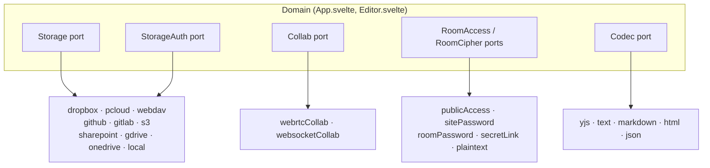

Warning: truncated output (original token count: 25473)
Total output lines: 650

# Copad architecture reference

Deep reference for how the codebase is structured: ports/adapters, wiring, file formats, config, deployment.
Contribution **rules** live in [`AGENTS.md`](../AGENTS.md): this file is descriptive, not normative, and nothing
here needs to be read before writing code; look things up as they become relevant. For the product-facing
overview (quick start, deployment steps, known limitations) see [`README.md`](../README.md).

## Architecture

Copad follows **hexagonal architecture** (ports & adapters, see
[Alistair Cockburn's original writeup](https://alistair.cockburn.us/hexagonal-architecture/)) with a
**functional style**: factory functions returning plain objects, never classes. See This section maps the
runtime components to their implementations.

```mermaid
flowchart TB
    subgraph Domain["Domain (App.svelte, Editor.svelte)"]
        direction LR
        Storage["Storage port"]
        StorageAuth["StorageAuth port"]
        Collab["Collab port"]
        RoomAccess["RoomAccess / RoomCipher ports"]
        Codec["Codec port"]
    end
    Storage --> A1["dropbox · pcloud · webdav\ngithub · gitlab · s3\nsharepoint · gdrive · onedrive · local"]
    StorageAuth --> A1
    Collab --> A2["webrtcCollab · websocketCollab"]
    RoomAccess --> A3["publicAccess · sitePassword\nroomPassword · secretLink · plaintext"]
    Codec --> A4["yjs · text · markdown · html · json"]
```

### Ports (interfaces)

| Port            | File                              | Description                                                                                                                                                                                                                                                                                                                                                                                                                                              |
| --------------- | --------------------------------- | -------------------------------------------------------------------------------------------------------------------------------------------------------------------------------------------------------------------------------------------------------------------------------------------------------------------------------------------------------------------------------------------------------------------------------------------------------- |
| `Storage`       | `src/storage/types.ts`            | Persist and restore document bytes for a backend's target file (bytes-only, no auth). Optional `list()`/`loadFrom()` let a backend also browse and read an arbitrary _other_ file within its already-connected scope (e.g. another file in the same GitHub repo or OneDrive AppFolder), implemented only where listing needs no new API surface or broader auth scope (GitHub, OneDrive personal); a backend without them simply has no "Browse…" entry. |
| `StorageAuth`   | `src/storage/auth.ts`             | Authenticate to a cloud storage backend; owns login/logout/config                                                                                                                                                                                                                                                                                                                                                                                        |
| `Collab`        | `src/collaboration/types.ts`      | Provide a shared Y.Doc and awareness channel                                                                                                                                                                                                                                                                                                                                                                                                             |
| `CollabConnect` | `src/collaboration/types.ts`      | Factory type: `(room: string) => Collab`                                                                                                                                                                                                                                                                                                                                                                                                                 |
| `RoomAccess`    | `src/collaboration/roomAccess.ts` | Who may join a room (`mode` + `credential(room)`)                                                                                                                                                                                                                                                                                                                                                                                                        |
| `RoomCipher`    | `src/collaboration/roomCipher.ts` | How a room is encrypted (`password(room): string \| null`)                                                                                                                                                                                                                                                                                                                                                                                               |
| `Codec`         | `src/format/types.ts`             | Convert file bytes ⟷ the shared Y.Doc, selected by filename extension                                                                                                                                                                                                                                                                                                                                                                                    |

### Adapters (implementations)

Storage adapters return `{ auth: StorageAuth; storage: Storage }`: auth and bytes live in a shared closure but
are exposed through separate ports. The `StorageBackend` type alias (in `src/storage/index.ts`) names the pair.

| Adapter               | File                             | Notes                                                                                                                                                                                                                                                                                                                          |
| --------------------- | -------------------------------- | ------------------------------------------------------------------------------------------------------------------------------------------------------------------------------------------------------------------------------------------------------------------------------------------------------------------------------ |
| `dropboxStorage()`    | `src/storage/dropbox.ts`         | OAuth2 PKCE, no proxy needed                                                                                                                                                                                                                                                                                                   |
| `pcloudStorage()`     | `src/storage/pcloud.ts`          | OAuth popup                                                                                                                                                                                                                                                                                                                    |
| `webdavStorage()`     | `src/storage/webdav.ts`          | Requires `VITE_PROXY_URL` (CORS)                                                                                                                                                                                                                                                                                               |
| `githubStorage()`     | `src/storage/github.ts`          | Commits to a GitHub repo via PAT; `contentFormat` is `'text'` for human-readable files, `'binary'` for `.yjs`.                                                                                                                                                                                                                 |
| `gitlabStorage()`     | `src/storage/gitlab.ts`          | Commits to a GitLab project (gitlab.com or self-hosted) via PAT; mirrors `githubStorage()` (configFields + validated flag + POST/PUT create-or-update).                                                                                                                                                                        |
| `s3Storage()`         | `src/storage/s3.ts`              | Any S3-compatible bucket (AWS, R2, MinIO, B2, GCS…). AWS SigV4 signed with `crypto.subtle` (no SDK); binary `.yjs`; bucket must allow CORS.                                                                                                                                                                                    |
| `sharepointStorage()` | `src/storage/sharepoint.ts`      | SharePoint or a _work/school_ account's OneDrive **for Business** via Microsoft Graph, delegated bearer token (credentialFields, like WebDAV); Graph has native CORS (no proxy).                                                                                                                                               |
| `gdriveStorage()`     | `src/storage/gdrive.ts`          | OAuth2 PKCE (like Dropbox); `drive.file` scope, file resolved by per-room filename; extension-driven `contentFormat`.                                                                                                                                                                                                          |
| `onedriveStorage()`   | `src/storage/onedrive.ts`        | _Personal_ Microsoft account OneDrive via Microsoft Graph, OAuth2 PKCE against the `consumers` tenant (rejects work/school accounts, no overlap with `sharepointStorage()`); `Files.ReadWrite.AppFolder` scope confines access to a dedicated `Apps/<AppName>` special folder, mirroring `drive.file`'s least-privilege shape. |
| `localFsStorage()`    | `src/storage/local.ts`           | File System Access API, Chrome/Edge only                                                                                                                                                                                                                                                                                       |
| `webrtcCollab()`      | `src/collaboration/webrtc.ts`    | y-webrtc peer-to-peer transport (**default**). Needs STUN, plus TURN on mobile/symmetric NAT.                                                                                                                                                                                                                                  |
| `websocketCollab()`   | `src/collaboration/websocket.ts` | y-websocket hub transport (opt-in via `VITE_COLLAB_TRANSPORT=websocket`). Central relay, **no WebRTC → no STUN/TURN**; server is in the data path (no E2E).                                                                                                                                                                    |

Both collab adapters are `CollabConnect` factories behind the same `Collab` port, so they're interchangeable.
`planCollab()` in `App.svelte` picks one via `resolveTransport(VITE_COLLAB_TRANSPORT)`: WebRTC by default,
WebSocket only when explicitly set to `websocket`.

**`webrtcCollab()`'s y-webrtc internals typing.** y-webrtc exposes no public types for its room/signaling
internals, so `webrtc.ts` declares narrow local interfaces (`WebrtcRoomConn`, `WebrtcRoom`, `SignalingConnLike`)
at the single cast boundary with the library, and casts through `unknown` there because the library's actual
shapes differ structurally (its `Room.bcConns` is a `Set`, not the `Map` used here). Two fields carry
non-obvious meaning:

- `WebrtcRoomConn.connected`: y-webrtc creates a `WebrtcConn` optimistically on `announce` (peer discovery),
  before its data channel opens. Sync and awareness only flow once the channel is open, so this flag — not the
  conn's mere presence — is the honest "can we exchange data with this peer?" signal. Counting conns that are
  present but not yet `connected` previously made the status pill claim "connected" while a peer was unreachable
  (e.g. failed NAT traversal with no working TURN).
- `SignalingConnLike.connected` / its `connect`/`disconnect` events: the live signaling-socket state, unlike
  `provider.connected`, which is just `shouldConnect && room !== null` and so is already true at construction,
  before any handshake succeeds. y-webrtc emits `status`/`peers` on room/peer changes but not when a signaling
  socket connects while alone, so the adapter bridges each socket's own connect/disconnect into the status
  machine directly.

Room access adapters (all in `src/collaboration/roomAccess.ts` / `roomCipher.ts` / `secretLink.ts`):

| Adapter            | Port(s)                     | Notes                                                                                                      |
| ------------------ | --------------------------- | ---------------------------------------------------------------------------------------------------------- |
| `publicAccess()`   | `RoomAccess`                | No credential; anyone may join (default)                                                                   |
| `sitePassword(pw)` | `RoomAccess`                | Single shared password from env (`VITE_ROOM_PASSWORD`)                                                     |
| `roomPassword()`   | `RoomAccess`                | Per-room password stored in `localStorage`                                                                 |
| `secretLink()`     | `RoomAccess` + `RoomCipher` | URL-fragment key (`#k=…`); dual-port: the key is simultaneously the access gate and the AES encryption key |
| `plaintext()`      | `RoomCipher`                | No encryption (`password()` returns `null`)                                                                |

`resolveRoomStrategy(VITE_ROOM_AUTH)` parses the env var once and returns a `RoomStrategy`: the
`{ access, cipher }` pair built **together** so each strategy keeps its concrete type end-to-end. In particular
the `secret-link` dual-port object is assigned directly to both fields (no
widen-to-`RoomAccess`-then-cast-back-to-`RoomCipher`). Lives in `src/collaboration/config.ts`.

Both adapters share `createCollabCore()` (`src/collaboration/core.ts`, the transport-agnostic half of a
`Collab`): status/synced subscriber fan-out, the `connecting → waiting → connected` machine (falling to
`unreachable` if not attached after `CONNECT_TIMEOUT_MS`, so the UI stops spinning on a dead/misconfigured
server; cleared by a successful attach or a manual `reconnect()`), online/offline reactivity, the local-cache
lifecycle, and teardown. Each adapter supplies only provider wiring + two hooks (`isAttached()`, `peerCount()`);
the duplicated boilerplate lives in one place.

### Wiring

`App.svelte` owns all construction and configuration:

- calls `backends()` to get the available `StorageBackend` pairs (`{ auth, storage }`)
- resolves `{ access: roomAccess, cipher: roomCipher } = resolveRoomStrategy(VITE_ROOM_AUTH)` at startup
- calls `planCollab()`, which returns a `build(cache)` that produces
  `webrtcCollab({ signaling, cipher, iceServers, cache })` by default, or `websocketCollab({ url, cache })` when
  `VITE_COLLAB_TRANSPORT=websocket`, plus any config warning to surface
- passes both down to `Editor.svelte` as props; Editor receives only the bytes-only `Storage` half (never
  `StorageAuth`)
- renders the storage **pills** + connect _action zone_, and the `Settings.svelte` drawer

`Editor.svelte` knows only the ports: it never imports y-webrtc, y-websocket, or any storage backend directly.
`Settings.svelte` receives `StorageBackend[]` and accesses auth via `b.auth.*`, metadata via `b.storage.*`.

### File formats (the `Codec` port)

A backend moves _bytes_; a **codec** (`src/format/`) turns those bytes into the shared `Y.Doc` and back. The
codec is chosen from the target **filename's extension** (`codecForFilename()`), so format support is entirely
backend-agnostic.

| Codec           | Extensions                                                                                     | Notes                                                                                                                                                                                                                                                                                                                                                                                                                                                                                                                                                                      |
| --------------- | ---------------------------------------------------------------------------------------------- | -------------------------------------------------------------------------------------------------------------------------------------------------------------------------------------------------------------------------------------------------------------------------------------------------------------------------------------------------------------------------------------------------------------------------------------------------------------------------------------------------------------------------------------------------------------------------- |
| `yjsCodec`      | `.yjs`                                                                                         | **Native default.** Full CRDT state (history + content): the only format that round-trips collaborative merge. Fallback for unknown extensions.                                                                                                                                                                                                                                                                                                                                                                                                                            |
| `textCodec`     | `.txt`, `.log`, `.csv` and ~90 source-code extensions (the list lives in `src/format/text.ts`) | Plain text and source files; one paragraph per line. Formatting flattened.                                                                                                                                                                                                                                                                                                                                                                                                                                                                                                 |
| `markdownCodec` | `.md`, `.markdown`                                                                             | CommonMark + GFM strikethrough (`~~`), checklists (`- [ ]`/`- [x]`), and tables. No native underline syntax: that mark is flattened to plain text on export. Table cells hold real block content (paragraphs, lists, headings, quotes, code blocks; see `schema.ts`'s `cellContent`), which GFM's pipe-table syntax can't express; such a table round-trips as an embedded raw HTML block (`format/tableMarkdown.ts`) instead, with a plain-text degrade when no DOM is available to build it. A table with only single-paragraph cells still stays plain GFM pipe syntax. |
| `htmlCodec`     | `.html`, `.htm`                                                                                | ProseMirror DOM parser/serializer; **needs a DOM** (browser only).                                                                                                                                                                                                                                                                                                                                                                                                                                                                                                         |
| `jsonCodec`     | `.json`                                                                                        | ProseMirror document JSON; lossless for our schema.                                                                                                                                                                                                                                                                                                                                                                                                                                                                                                                        |

- Content codecs reconcile into the shared doc via y-prosemirror's `prosemirrorToYXmlFragment` (the same diff
  reconciler as `ySyncPlugin`), so importing replaces content cleanly: no duplicated leading paragraph. Shared
  PM↔Y helpers live in `src/format/pm.ts`.
- Each backend reports its target filename via `Storage.filename()`. **Local** takes it from the picked file;
  **cloud** backends expose `setFilename()` (a "File name" input in Settings, persisted by `filenameStore()` in
  `src/storage/filename.ts`). The extension picks the format; it takes effect on connect.
- **The target file is scoped per room.** `filenameStore(backendId, room)` takes the room as a parameter and
  persists the name per backend _and room_ under `storage.<id>.filename.<room>`. **Every room** a backend saves
  derives its own file from the room id, keeping the backend default's extension (so `copad-demo` →
  `copad-demo.yjs`, and no two rooms on one backend collide on one path). This, together with saved rooms above,
  is what gives each room its own document. (**Local** is the exception: it holds a single picked file in module
  state and has no `setFilename`, so it effectively serves one room's document at a time; switching rooms no
  longer carries content, but re-importing in another room repoints its one file.)
- Adding a format = add one codec file + register it in `src/format/index.ts`. The Local file picker
  (`knownExtensions()`) and Settings copy update automatically.
- **`Export a copy`** (contract §4.3): a one-off download of the current document, independent of any connected
  storage backend and working while the write-gate holds the editor read-only. `exportCodecs`
  (`src/format/index.ts`) offers the four portable `Codec` formats (text/markdown/html/json) plus one-way
  `ExportCodec` formats (below), excluding the native `.yjs` snapshot. `src/editor/exportBridge.svelte.ts`
  mirrors the `roomName` bridge's shape: a module-level holder the Editor binds on mount (unconditionally, since
  export is a read) so UI outside the Editor subtree can encode the shared `Y.Doc` without it being threaded
  through as a prop. `src/ui/ExportFormats.svelte` is the shared format-picker list;
  `src/ui/ExportDialog.svelte` wraps it in the standard `Dialog.svelte` shell for two of its three triggers: the
  read-only band (`SyncBanner`'s waiting tier, next to Copy invite link / Connect storage) and an Export button
  in `App.svelte`'s header capsule — the same desktop element and its `.mobile-capsule` sibling below 900px —
  right beside Share and Settings (`App.svelte`'s `exportOpen` state, no prop threading through Editor at all,
  since export never touches `collab.doc`), while Settings renders `ExportFormats` inline in its own section
  instead. Three reachable entry points, one download path (`downloadBytes()` in `src/format/download.ts`, File
  System Access API save picker with a Blob+anchor fallback).
- **`ExportCodec`** (`src/format/types.ts`) is a one-way sibling of `Codec`
  (`{ id, label, extensions, encode(doc) }`, no `decode`), for formats that are never a save target. It's never
  added to `codecs`/`knownExtensions()`: there's nothing to decode if a `.docx` is picked in the Local import
  flow. Every `Codec` structurally satisfies `ExportCodec` too, so `exportCodecs` combines both kinds in one
  list.
- **PDF**: no client-side rendering library: `ExportFormats.svelte`'s "PDF (print)" entry calls
  `window.print()`, and `src/styles/print.css` hides all app chrome under `@media print`, leaving only
  `.editor > .content` to flow across pages. Real, selectable text at native quality; the trade-off is the extra
  step of choosing "Save as PDF" in the browser's own print dialog.
- **`docxCodec`** (`src/format/docx.ts`): Word export via the `docx` package. Covers headings,
  emphasis/strike/underline/code marks, links, nested bullet/ordered/task lists, blockquotes, code blocks,
  horizontal rules and tables. `docx.ts` itself is a thin descriptor; the actual encoding logic (and the `docx`
  package, ~100kB gzipped) lives in `src/format/docxEncode.ts`, reached only via a dynamic `import()` inside
  `encode()`, so that cost lands only on a page that actually triggers a Word export, not on the main bundle for
  every visitor.
- **`Import…`**: a document-level action, not a formatting command, so its button lives in `App.svelte`'s header
  capsule beside Export, not the formatting toolbar. `App.svelte`'s `importLocalFile()` picks a file
  (`src/format/filePicker.ts`'s `pickFile()`, shared with `src/storage/local.ts`'s own picker) and hands the
  bytes down through the same `importRequest`/`onImportHandled` bridge Settings' Browse-a-connected-backend
  dialog uses. App owns every import entry point, but only `Editor.svelte` holds `collab.doc`, so decoding
  always happens there. Unlike export, this is a write: `decode()` writes straight into `collab.doc`, bypassing
  ProseMirror's own `editable` check entirely, so the write-gate is re-derived independently at both ends:
  `App.svelte`'s header button disables itself (`role === SessionRole.Writer && !writeLocked`), and
  `Editor.svelte`'s `importRequest` effect re-checks the identical condition before ever calling `decode()`, so
  the gate holds even if a request arrived some other way. Replacing a non-empty document asks for confirmation
  first (`window.confirm`), since it overwrites content for every live collaborator.
- **`Your documents`**: the local library's entry point, a button in `App.svelte`'s header capsule beside
  Import/Export, opening `src/ui/LibraryDialog.svelte` (a `Dialog.svelte` shell listing the rooms this browser
  has opened, each with a per-row remove, plus a "New document" action). Since `room` is fixed for the tab's
  lifetime (below), an entry can't be switched to in place: each row is a real `<a href>` built by
  `roomVisitUrl()`, opened `target="_blank" rel="noopener"` so the tab you are in keeps its document, exactly as
  `newRoom()` does. A link rather than a `window.open` button so the row also honours middle/⌘-click, copy-link,
  and the browser's own open-in-new-window. See **The local library (room history)** under Implementation notes
  for what is stored and why the URL is derived rather than persisted.

- **PWA / share sheet**: `public/manifest.webmanifest` (linked from `index.html`) makes Copad installable;
  `public/sw.js` is a minimal pass-through service worker (`fetch` → `fetch(event.request)`, no caching)
  registered by `src/main.ts`, present only because some platforms still gate install-ability on a registered
  service worker. It does not cache the app shell or touch the Y.Doc/storage/collab layers, so it has no bearing
  on the P2P/local-cache/no-account model. **Caching nothing is a requirement, not an omission**: a navigation
  fallback would swallow `/redirect.html` and kill every OAuth sign-in, a query-ignoring cache key would
  collapse `?room=…` and `?text=…` onto one entry, and `index.html` carries a build-time-injected
  `VITE_APP_NAMESPACE` so a stale copy reads the previous deployment's `localStorage` keys. `sw.js` itself
  carries only a one-line pointer back to this entry, to keep the rationale in one place.
  - **Base path.** `public/` is copied verbatim, so nothing in the manifest is rewritten for a subpath build
    (`BUILD_BASE=/copad/`, read by `vite.config.ts` and set by the Pages deploy and the PR previews). Every
    manifest URL — `id`, `start_url`, `scope`, `share_target.action`, each icon `src` — is therefore **relative
    to the manifest**, which resolves correctly at both `/` and `/copad/`. `main.ts` registers the service
    worker via `asset('sw.js')`, the same `src/ui/imageIcons.ts` helper the icon URLs use, for the same reason.
    Vite _does_ rewrite `link[href]`/`script[src]` inside `index.html`, so those stay root-absolute.
  - Launching the installed app hits `start_url` with no `?room=`, so `resolveLandingRoom()` lands you in
    `VITE_DEFAULT_ROOM` or a freshly minted room — installing from a room page does **not** pin the icon to that
    room (a static manifest cannot capture it). The local library (`LibraryDialog`) is the way back. `scope`
    covers the whole app directory, so a future in-app view stays inside the installed window.
  - `ShareDialog.svelte` adds a `📤 Share` button that calls `navigator.share()` when `'share' in navigator`,
    falling back to a small set of deep-link options (WhatsApp, SMS, email) otherwise, purely additive,
    alongside the existing copy-to-clipboard flow. The manifest's…10473 tokens truncated…                                                                                                                                                                                   |
| `VITE_GITHUB_API_URL`                                                                                                                                                                                                                 | no         | GitHub REST API base (default: `https://api.github.com`); set for a GitHub Enterprise host. In `src/storage/constants.ts`.                                                                                                                                                                                                                                                                                                                                                      |
| `VITE_GITLAB_PROJECT`                                                                                                                                                                                                                 | no         | Locks the GitLab project (`namespace/project`); otherwise set at runtime in Settings.                                                                                                                                                                                                                                                                                                                                                                                           |
| `VITE_GITLAB_HOST`                                                                                                                                                                                                                    | no         | Locks the GitLab instance host (default: `https://gitlab.com`); set for self-hosted GitLab.                                                                                                                                                                                                                                                                                                                                                                                     |
| `VITE_GITLAB_BRANCH`                                                                                                                                                                                                                  | no         | Locks the GitLab branch (default: `main`); otherwise set at runtime in Settings.                                                                                                                                                                                                                                                                                                                                                                                                |
| `VITE_GITLAB_TOKEN`                                                                                                                                                                                                                   | no         | Locks the GitLab PAT; bypasses the Connect validation step (deployment-managed).                                                                                                                                                                                                                                                                                                                                                                                                |
| `VITE_GITLAB_API_PATH`                                                                                                                                                                                                                | no         | GitLab REST API path appended to the host (default: `/api/v4`). In `src/storage/constants.ts`.                                                                                                                                                                                                                                                                                                                                                                                  |
| `VITE_GITLAB_DEFAULT_FILENAME`                                                                                                                                                                                                        | no         | Initial GitLab target file (default: `notes.md`).                                                                                                                                                                                                                                                                                                                                                                                                                               |
| `VITE_S3_PREFIX`                                                                                                                                                                                                                      | no         | Object-key prefix (folder) the S3 backend reads/writes within (default: `copad`).                                                                                                                                                                                                                                                                                                                                                                                               |
| `VITE_GRAPH_API_URL`                                                                                                                                                                                                                  | no         | Microsoft Graph API base (default: `https://graph.microsoft.com/v1.0`); set for a national cloud.                                                                                                                                                                                                                                                                                                                                                                               |
| `VITE_SHAREPOINT_FOLDER`                                                                                                                                                                                                              | no         | Drive folder SharePoint/OneDrive reads/writes within (default: `Documents`).                                                                                                                                                                                                                                                                                                                                                                                                    |
| `VITE_GDRIVE_CLIENT_ID`                                                                                                                                                                                                               | no         | Locks the Google Cloud OAuth Client ID; otherwise set at runtime in Settings.                                                                                                                                                                                                                                                                                                                                                                                                   |
| `VITE_GDRIVE_AUTH_URL` / `VITE_GDRIVE_TOKEN_URL` / `VITE_GDRIVE_FILES_URL` / `VITE_GDRIVE_UPLOAD_URL` / `VITE_GDRIVE_SCOPE`                                                                                                           | no         | Google Drive OAuth/Drive endpoint + scope overrides (defaults are the public Google endpoints; scope defaults to `drive.file`).                                                                                                                                                                                                                                                                                                                                                 |
| `VITE_ONEDRIVE_CLIENT_ID`                                                                                                                                                                                                             | no         | Locks the personal-OneDrive Microsoft Entra Client ID; otherwise set at runtime in Settings.                                                                                                                                                                                                                                                                                                                                                                                    |
| `VITE_ONEDRIVE_AUTH_URL` / `VITE_ONEDRIVE_TOKEN_URL` / `VITE_ONEDRIVE_SCOPE`                                                                                                                                                          | no         | Personal OneDrive OAuth endpoint + scope overrides (defaults are the public Microsoft identity platform `consumers` tenant endpoints; scope defaults to `Files.ReadWrite.AppFolder offline_access`).                                                                                                                                                                                                                                                                            |
| `VITE_CLOUD_FOLDER`                                                                                                                                                                                                                   | no         | Folder the cloud backends (Dropbox, pCloud) read/write within (default: `/copad`). In `src/storage/constants.ts`.                                                                                                                                                                                                                                                                                                                                                               |
| `VITE_DEFAULT_FILENAME`                                                                                                                                                                                                               | no         | Initial target filename for cloud backends (default: `document.yjs`); the extension selects the codec.                                                                                                                                                                                                                                                                                                                                                                          |
| `VITE_GITHUB_DEFAULT_FILENAME`                                                                                                                                                                                                        | no         | Initial GitHub target file (default: `notes.md`).                                                                                                                                                                                                                                                                                                                                                                                                                               |
| `VITE_REDIRECT_URI`                                                                                                                                                                                                                   | no         | OAuth redirect URI (default: `<origin>/redirect.html`). In `src/storage/constants.ts`.                                                                                                                                                                                                                                                                                                                                                                                          |
| `VITE_DROPBOX_AUTH_URL` / `VITE_DROPBOX_TOKEN_URL` / `VITE_DROPBOX_UPLOAD_URL` / `VITE_DROPBOX_DOWNLOAD_URL`                                                                                                                          | no         | Dropbox OAuth/content endpoint overrides (defaults are the public dropbox.com / dropboxapi.com URLs). For when Dropbox rotates a domain.                                                                                                                                                                                                                                                                                                                                        |
| `VITE_PCLOUD_API_HOST` / `VITE_PCLOUD_EU_API_HOST`                                                                                                                                                                                    | no         | pCloud API hosts (defaults: `api.pcloud.com` / `eapi.pcloud.com`). Override for a region change.                                                                                                                                                                                                                                                                                                                                                                                |
| `VITE_PCLOUD_GETFILELINK_PATH` / `VITE_PCLOUD_UPLOAD_PATH`                                                                                                                                                                            | no         | pCloud API paths (defaults: `/getfilelink` / `/uploadfile`).                                                                                                                                                                                                                                                                                                                                                                                                                    |
| `VITE_OAUTH_TIMEOUT_MS`                                                                                                                                                                                                               | no         | How long to wait for the OAuth popup before giving up (default: `300000`).                                                                                                                                                                                                                                                                                                                                                                                                      |
| `VITE_OAUTH_POPUP_FEATURES`                                                                                                                                                                                                           | no         | OAuth popup window features (default: `width=520,height=640`).                                                                                                                                                                                                                                                                                                                                                                                                                  |
| `VITE_BASE64_CHUNK`                                                                                                                                                                                                                   | no         | Chunk size for base64-encoding large GitHub/GitLab uploads (default: `32768`).                                                                                                                                                                                                                                                                                                                                                                                                  |
| `VITE_PROXY_URL`                                                                                                                                                                                                                      | for WebDAV | CORS proxy URL                                                                                                                                                                                                                                                                                                                                                                                                                                                                  |
| `VITE_WEBDAV_URL`                                                                                                                                                                                                                     | no         | Pre-fill the WebDAV URL input                                                                                                                                                                                                                                                                                                                                                                                                                                                   |
| `VITE_STORAGE_BACKEND`                                                                                                                                                                                                                | no         | Default storage backend id                                                                                                                                                                                                                                                                                                                                                                                                                                                      |
| `VITE_ENABLE_DROPBOX` / `VITE_ENABLE_PCLOUD` / `VITE_ENABLE_WEBDAV` / `VITE_ENABLE_GITHUB` / `VITE_ENABLE_GITLAB` / `VITE_ENABLE_S3` / `VITE_ENABLE_SHAREPOINT` / `VITE_ENABLE_GDRIVE` / `VITE_ENABLE_ONEDRIVE` / `VITE_ENABLE_LOCAL` | no         | Hide a backend entirely: no pill, no Settings section. Only WebDAV and Local default to `true`; every other backend stays `false` until it has been connected to a real account outside production, which is its own dedicated PR. In `src/storage/constants.ts`'s `BACKEND_ENABLED`.                                                                                                                                                                                           |
| `VITE_STUN_URL`                                                                                                                                                                                                                       | no         | STUN server(s), comma-separated (default: `stun:stun.l.google.com:19302`; set empty to disable). Via `resolveIceServers()`.                                                                                                                                                                                                                                                                                                                                                     |
| `VITE_TURN_URL`                                                                                                                                                                                                                       | no         | TURN relay url(s), comma-separated. Needed for restrictive/mobile NATs (CGNAT / symmetric NAT). When unset, a public default relay (`DEFAULT_TURN` in `config.ts`) is used unless disabled. Runtime Settings TURN (`turn.ts`) overrides this.                                                                                                                                                                                                                                   |
| `VITE_TURN_USERNAME`                                                                                                                                                                                                                  | no         | TURN username.                                                                                                                                                                                                                                                                                                                                                                                                                                                                  |
| `VITE_TURN_PASSWORD`                                                                                                                                                                                                                  | no         | TURN password.                                                                                                                                                                                                                                                                                                                                                                                                                                                                  |
| `VITE_ICE_SERVERS_URL`                                                                                                                                                                                                                | no         | HTTP(S) endpoint returning `{ iceServers: [...] }` (e.g. the Cloudflare TURN Worker in `deploy/ice-worker/`). When set, the frontend fetches ICE at startup instead of using static `VITE_TURN_*`, for providers that mint short-lived credentials from a secret API token. Resolved by `resolveIceServersUrl()`; fetched via `fetchIceServers()`. Runtime Settings TURN still overrides it. WebRTC transport only.                                                             |
| `VITE_ICE_FETCH_TIMEOUT_MS`                                                                                                                                                                                                           | no         | How long (ms) to wait for `VITE_ICE_SERVERS_URL` before falling back to env/default ICE (default: `5000`). In `src/collaboration/constants.ts`.                                                                                                                                                                                                                                                                                                                                 |

## Collaboration servers

Real-time collab needs a server, but **none lives in this repo**: both transports run an upstream package's
bundled server (don't reinvent the wheel):

- **WebRTC** → a y-webrtc signaling server: the `y-webrtc-signaling` bin (from the `y-webrtc` dep; reads `PORT`,
  default 4444). `npm run signaling` runs it locally.
- **WebSocket** → a y-websocket hub: the `y-websocket-server` bin (from the `@y/websocket-server` devDep; reads
  `HOST`/`PORT`, serves `okay`). `npm run collab` runs it locally.

To deploy either, point a host (Render/Fly/any VPS) at a 3-line `package.json` that depends on the upstream
package with `"start"` calling its bin; `npm install` puts it in `node_modules` on the host. See README
"Deployment" for the operator-facing steps.

Deployment-side artifacts (ops templates and self-hosted endpoints, **not** app source) live under **`deploy/`**
(kept out of `src/` so the app/infra boundary is obvious):

**`deploy/turn/`** is the one server-ish thing we ship: a self-hosted [coturn](https://github.com/coturn/coturn)
TURN relay (`turnserver.conf.example` + `docker-compose.yml` + guide) for WebRTC NAT traversal, because coturn
has no equivalent drop-in. TURN needs a UDP port range, so it wants a VPS, not a PaaS. The shipped config is a
template: the live `turnserver.conf` is git-ignored (it holds the shared secret + public IP), the credential is
treated as public (it's inlined into the client bundle), and the config caps abuse with TURN quotas + SSRF deny
ranges. Optional: a free public default relay (`DEFAULT_TURN`) works out of the box.

**`deploy/ice-worker/`** (see also "Publishing" below): for providers that mint _short-lived_ TURN credentials
from a **secret** API token (Cloudflare TURN), a static `VITE_TURN_*` won't do: the token can't ship in the
client bundle. This Worker holds the token server-side and returns fresh `{ iceServers: [...] }` JSON. Set
`VITE_ICE_SERVERS_URL` to its URL and the frontend fetches ICE at startup (`fetchIceServers()` in
`src/collaboration/iceServers.ts`, parsed by `parseIceServersResponse()`), reconnecting once creds arrive via
the existing `collabEpoch` path. Precedence in `App.svelte`'s `buildIce()`: runtime TURN (Settings) → fetched
ICE → static env / `DEFAULT_TURN`.

## Publishing (GitHub Pages)

`.github/workflows/deploy.yml` builds `main` with `BUILD_BASE=/copad/` and hands `dist/` to
`.github/scripts/deploy-gh-pages.sh`, which publishes it onto the **`gh-pages` branch** — branch-based Pages,
not the artifact API, so production (branch root) and the `pr-<N>/` previews written by `pr-preview.yml` coexist
on one branch. Every write to that branch goes through the one script — publishing the root, publishing a
preview, and `--remove`-ing a preview when its PR closes — so all three inherit the same push-race retry rather
than the cleanup open-coding a bare push that loses the race. `ensure-pages-source.cjs` re-asserts the setting
the whole scheme depends on (Source = `gh-pages`, `/`) on every deploy.

`npm run build` (`package.json`) also runs `scripts/build-docs.mjs`, which renders `docs/contract.md` into
`dist/docs/contract.html` — Copad's own styled page rather than GitHub's blob view — so it ships with every
build, self-hosted or Pages alike. `docs/contract.md` stays the only source of that text (AGENTS.md: "every fact
lives in exactly one place"); the script only changes how it's presented, keeping GitHub's own heading-anchor
slugs so existing `#section-name` links keep resolving. `aboutCopy.ts`'s `contractUrl()`/`privacyUrl()` build
the link from the `page` path `App.svelte` already tracks (`location.pathname`), so About's "The contract" link
resolves under whatever base path the deployment is served from.

Two properties of the publish are load-bearing, both learned from an outage that left the live site 65 commits
behind `main` for three days:

- **The root publish clears in place; it never `rm -rf`s the worktree.** `publish_path` _is_ the worktree for a
  production deploy, and removing it takes its `.git` link with it — git then resolves to the parent repo, so
  the deploy commits the site onto the checked-out branch while `push origin gh-pages` reports "Everything
  up-to-date" and exits 0 having published nothing. The root sweep skips `pr-*` for the same reason the previews
  exist at all.
- **The deploy supersedes rather than queues** (`concurrency.cancel-in-progress: true`). Each run publishes a
  complete build, so the newest push is the only one worth finishing. Queuing let one run stuck in `queued` hold
  the group indefinitely: GitHub cancels the _previously pending_ run whenever a new one arrives, so every
  subsequent push was cancelled before its first step.
- **The job claims no `environment`.** Under branch-based Pages the auto-managed `github-pages` environment
  carries a deployment branch policy scoped to `gh-pages`, so a job on `main` declaring it is never allowed to
  start — the state the run that first held the group above was stuck in. It was decoration: the publish is a
  plain push under `contents: write`.

Neither condition turns a run red — `cancelled` is not `failure`, and the second failed only after reporting a
successful push. So the deploy records what it published: `deploy-gh-pages.sh` stamps `version.json`
(`{ commit, ref }`) into whatever it writes, and `deploy-drift.yml` compares the live commit against `main`
hourly, failing when production falls behind. A deploy that never ran cannot report itself; only a check outside
the run can.
